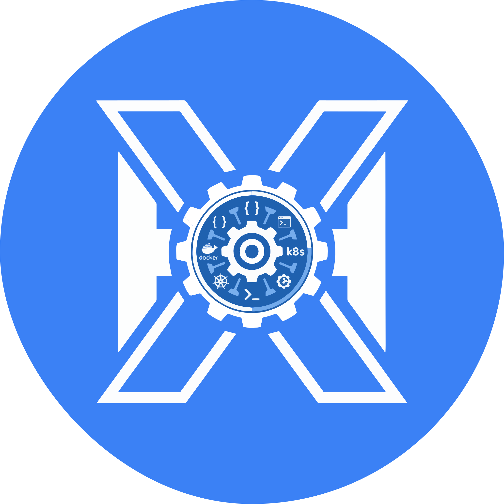
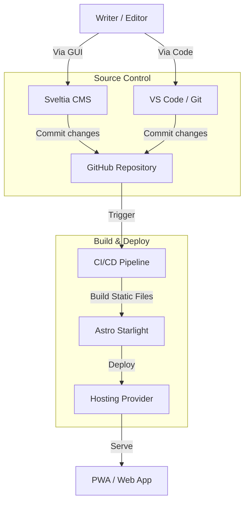

# 📚 Docs Starlight

> **Your Second Brain.** — A premium, PWA-ready documentation hub powered by Astro Starlight and Sveltia CMS.

<!-- BADGES -->
[](https://astro.build)
[](https://starlight.astro.build)
[](https://github.com/sveltia/sveltia-cms)
[](LICENSE)

<p align="center">
  
  <br>
  <em>(Replace with your dashboard screenshot)</em>
</p>

---

## ✨ Features

| Feature              | Description                                                                  |
| :------------------- | :--------------------------------------------------------------------------- |
| 📚 **Starlight Core** | Built on top of the powerful Astro 5 framework for blazing fast performance. |
| ✏️ **Visual CMS**     | Integrated **Sveltia CMS** for managing content without touching code.       |
| 📱 **PWA Ready**      | Fully installable as a native app on Mobile and Desktop.                     |
| 🎨 **Premium UI**     | Custom styled components, dark mode, and sleek aesthetics.                   |
| 🔍 **SEO Optimized**  | Automatic sitemaps, meta tags, and open graph generation.                    |

---

## 🚀 Quick Start

### Prerequisites
- Node.js 18+
- Git installed
- GitHub Account (for CMS backend)

### 1. Create your project
You can use **GitHub CLI** to clone this template directly:

```bash
# Clone the repository
gh repo clone herwingx/docs-starlight my-docs

# Enter the directory
cd my-docs
```

### 2. Install dependencies
```bash
npm install
```

### 3. Start Development Server
```bash
npm run dev
```

**Local URLs:**
- 📖 **Docs:** `http://localhost:4321`
- 🎛️ **Admin:** `http://localhost:4321/admin/`

---

## 🏗️ Architecture



---

## 📦 Deployment Options

This template is cloud-agnostic. You can deploy it anywhere static sites are supported.

| Platform             | Setup                               | Command         |
| :------------------- | :---------------------------------- | :-------------- |
| **Cloudflare Pages** | Connect Repo → Preset: `Astro`      | `npm run build` |
| **GitHub Pages**     | Settings → Source: `GitHub Actions` | `npm run build` |
| **Vercel**           | Import Project → Preset: `Astro`    | `npm run build` |
| **Netlify**          | Import Project → Preset: `Astro`    | `npm run build` |

### Using GitHub CLI for Deploy (Example)
If you want to set up GitHub Pages quickly:

```bash
# Enable GitHub Pages via Actions
gh repo edit --enable-pages --source-branch main --source-path /
```

---

## 📝 Content Management

### Using the Visual CMS
1. Navigate to `/admin/`.
2. Login with your GitHub account.
3. Create or edit collections visually.
4. Updates are automatically committed to your repo.

### Manual Editing (MDX)
Create new `.mdx` files in `src/content/docs/`:

```mdx
---
title: My New Page
description: A description for SEO
---

# Hello World
This is a new documentation page.
```

---

##  Useful Commands

| Command           | Action                               |
| :---------------- | :----------------------------------- |
| `npm run dev`     | Start local dev server               |
| `npm run build`   | Build for production                 |
| `npm run preview` | Preview the production build locally |
| `npm run dev:cms` | Run dev server with local CMS proxy  |

---

## 🛠️ Tech Stack

**Frontend**
- **Framework**: Astro 5
- **Theme**: Starlight theme
- **Styles**: CSS Variables + Custom Glassmorphism

**Tools**
- **CMS**: Sveltia CMS (Git-based)
- **Icons**: Phosphor / Astro Icon
- **PWA**: Vite PWA Plugin

---

## 🤝 Contributing & License

Feel free to fork this project and use it as a base for your own documentation.

1. Fork the repo: `gh repo fork herwingx/docs-starlight`
2. Create feature branch: `git checkout -b feature/amazing-docs`
3. Commit changes: `git commit -m 'feat: add amazing docs'`
4. Push: `git push origin feature/amazing-docs`

Licensed under **MIT**.
