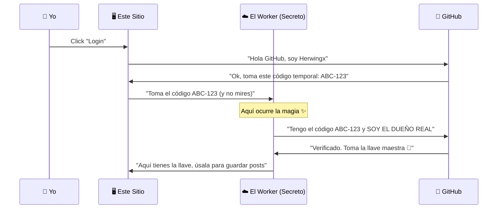

Este es uno de los temas más locos: **¿Cómo te logueas en un sitio que son puros archivos HTML?**

Normalmente necesitas una base de datos y un servidor (Node, Python). Pero aquí usamos magia de la nube llamada **Cloudflare Workers**.

## 🧠 El Problema

1.  Este sitio vive en GitHub Pages (es estático).
2.  Quiero un panel de administrador (`/admin`) para escribir posts.
3.  Ese panel necesita permiso para guardar en mi GitHub.
4.  **GitHub dice:** "Ok, dame tu contraseña secreta".
5.  **El problema:** Si pongo la contraseña en el sitio estático, ¡todo el mundo la puede ver! 😱

## 💡 La Solución: Un "Puente" Invisible

Usé un pequeño script que vive en la nube (Worker). Nadie ve el código de ese script, así que ahí guardo el secreto.



### ¿Te explotó la cabeza? 🤯

Esto se llama **OAuth Flow** y es lo que usan todos (Google, Facebook) para iniciar sesión en apps. Si quieres aprender a hacerlo tú mismo, revisa mis tutoriales de [Backend](/backend/).

---

## 🛠️ Código Real del Worker

Para los curiosos, así se ve el código JavaScript que hace de puente:

```javascript
// Este código corre en la red de Cloudflare, no en tu navegador
export default {
  async fetch(req) {
    // Cuando el sitio pide autorización...
    // ¡Hacemos el intercambio secreto aquí!
    const clientSecret = env.SECRET; // Nadie ve esto
    // ... lógica compleja de fetch a GitHub ...
    return new Response("Toma tu token 🔑");
  }
}
```

:::tip[Aprende esto]
Entender estos flujos te separa de ser un "Junior" a ser un "Senior". No es solo escribir código, es entender **sistemas**.
:::
